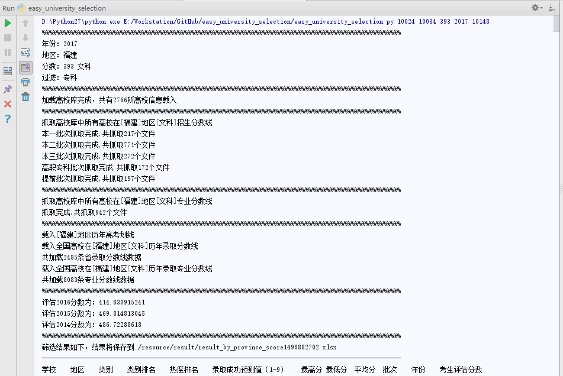
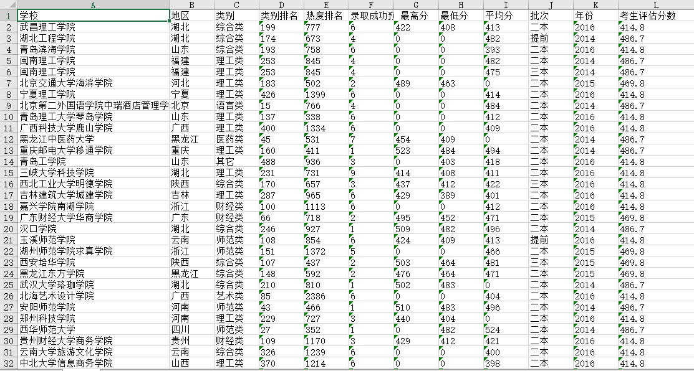
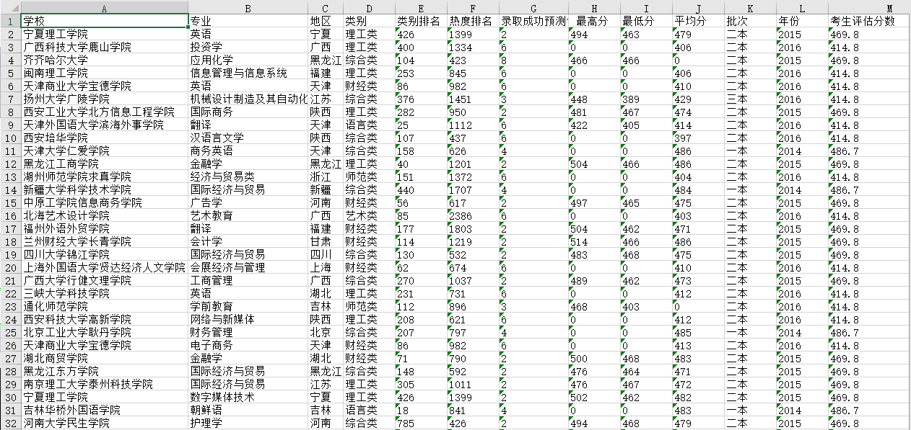

# easy_university_selection
一个抓取全国高校历年在各地区的录取分数线的项目（包括专业），用于高考学生筛选学校

## 背景
家里亲戚小孩高考，文科，竟然咨询我一个学渣如何报考。
我一个理科学渣更是不懂文科学校报考。
网站上查了半天各个学校分数线，也是麻烦。
于是就抓了网站上面各大高校的分数线，筛选一番。。。

## 脚本使用方法
```
./easy_university_selection.py 10024 10034 393 2017 10148
```
`10024` 表示福建地区
`10034` 表示文科
`393` 考生分数
`2017` 表示高考年份
`10148` 表示专科（这个参数用于过滤筛选，表示排除专科）



## 基本算法
### 评估考生对应的历年高考分数
   - 粗暴的算法评估分数（只评估近三年的分数）
   - 计算 学生的分数在今年高考划线的比值
   - 如 该生文科393 ，2017 划线 489,380,300 ，比值分别是393/489=0.803,393/380=1.034,393/300=1.31
   - 2016年，划线501,403,319,预估得分为(501X0.803+403X1.034+319X1.31)/3=412.3,预估该生在2016分数为412.3
   - 是否要考虑考生人数，难度干预系数等，有时间再看看
   - update 20170630 按照分数所在批次加权计算
### 筛选方法
   - 抓取的数据 主要包括某高校(包含专业)在某地区某批次入取的最高分，最低分，平均分
   - 这样一共分为9个等级（1-9）：如 北京大学 在 福建 文科
   - 2016年 入取 最高分 400 最低分 350 平均分 380
   - 2015年 入取 最高分 400 最低分 350 平均分 380
   - 2014年 入取 最高分 400 最低分 350 平均分 380
   - 按时间衰减计算(考虑这样的梯度是否能准确衡量，可以调整)
   - 考生1分数为 393（高于平均分），算出2016年的样本数据入取预测值为6,2015年为5,2014年为4
   - 考生2分数为 420（高于最高分），算出2016年的样本数据入取预测值为9,2015年为8,2014年为7
   - 考生3分数为 354（高于最低分），算出2016年的样本数据入取预测值为3,2015年为1,2014年为1

## 结果



## 其他定义
 10035 理科
 10034 文科

 10036 一本
 10037 二本
 10038 三本
 10148 专科

上海 10000
云南 10001
内蒙古 10002
北京 10003
吉林 10004
四川 10005
天津 10006
宁夏 10007
安徽 10008
山东 10009
山西 10010
广东 10011
广西 10012
新疆 10013
江苏 10014
江西 10015
河北 10016
河南 10017
浙江 10018
海南 10019
湖北 10021
湖南 10022
甘肃 10023
福建 10024
西藏 10025
贵州 10026
辽宁 10027
重庆 10028
陕西 10029
青海 10030
黑龙江 10031
